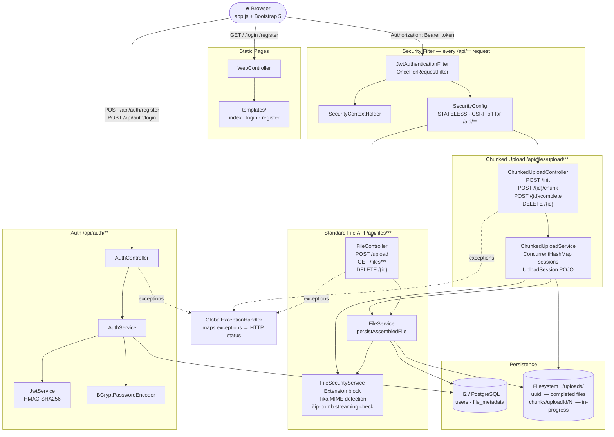

# Architecture — Java File Upload Demo

## 1. System Overview

This is a Spring Boot 3.2 web application that provides secure, role-scoped file upload and download functionality behind JWT authentication. The primary purpose is to demonstrate security best practices for file handling in a REST API: extension blocking, real MIME-type detection via Apache Tika magic-number inspection, zip-bomb detection, and UUID-based storage that prevents path-traversal attacks.

Authentication is fully stateless. Clients receive a JWT on registration or login and present it as a `Bearer` token on every subsequent request. The server never creates an HTTP session. Role-based access control differentiates regular users (who can only see their own files) from administrators (who can see and act on all files). A brute-force mitigation layer counts failed login attempts and locks accounts after a configurable threshold.

The frontend is a thin Bootstrap 5 single-page application served as static Thymeleaf templates. All dynamic behavior is implemented in vanilla JavaScript (`app.js`) that calls the REST API directly. No server-side rendering of user data takes place — the templates are pure HTML and Thymeleaf is used only as a static file delivery mechanism.

The persistence layer uses H2 in-memory for development and PostgreSQL in production, with DDL managed automatically in dev (`create-drop`) and validated-only in production (`validate`). File bytes are stored on the local filesystem; only metadata (original filename, MIME type, size, owner, scan status) is stored in the database.

---

## 2. Architecture Diagram

---

## 3. Component Breakdown

### `config/`
Contains the two primary configuration beans. `AppProperties` is a `@ConfigurationProperties` record bound to the `app.*` namespace in `application.properties`, providing typed access to JWT settings, upload directory, file size limits, and lockout thresholds. `SecurityConfig` assembles the Spring Security filter chain: it registers `JwtAuthenticationFilter` before `UsernamePasswordAuthenticationFilter`, disables CSRF for the `/api/**` path (because stateless JWT clients cannot maintain CSRF tokens), enables H2 console iframes via `sameOrigin` frame options, and declares `SessionCreationPolicy.STATELESS`. It also defines the `BCryptPasswordEncoder` and `DaoAuthenticationProvider` beans.

### `controller/`
Four controllers handle all inbound HTTP. `AuthController` exposes `POST /api/auth/register` and `POST /api/auth/login`, delegating entirely to `AuthService` and returning `AuthResponse` JSON. `FileController` owns the standard single-request `/api/files/**` routes and contains a private `isAdmin()` helper that inspects the current `Authentication`'s authorities — this authority check happens in the controller so the service methods receive a plain `boolean` and stay testable without a security context. `ChunkedUploadController` owns the four `/api/files/upload/**` endpoints (init, chunk, complete, abort) that support large file uploads in pieces; each endpoint retrieves the active `UploadSession` from `ChunkedUploadService` and verifies that the session belongs to the authenticated user before proceeding. `WebController` is a traditional `@Controller` (not `@RestController`) that returns Thymeleaf view names for the three SPA pages; no model data is added because the pages are driven entirely by `app.js`.

### `dto/`
Data Transfer Objects that cross the controller–service boundary or the HTTP boundary. `LoginRequest` and `RegisterRequest` carry Bean Validation annotations (`@NotBlank`, `@Size`) that are enforced by `@Valid` in the controllers before service code is reached. `AuthResponse` is the JWT envelope returned on success. `FileMetadataDto` is the public representation of a file — it intentionally omits `storagePath` and `filename` (UUID) to avoid leaking internal storage structure. `FileDownloadResult` is an internal value type (Java record) used to carry the `Resource`, original filename, and MIME type from `FileService` to `FileController` without coupling the service to HTTP headers.

### `exception/`
`FileSecurityException` is a typed `RuntimeException` raised by `FileSecurityService` for any content-policy violation. `GlobalExceptionHandler` is a `@RestControllerAdvice` that centralises all error-to-HTTP-status mapping. Each handler method returns a `Map<String, String>` with a single `"error"` key, giving the frontend a consistent JSON error shape regardless of which exception was thrown.

### `model/`
Four JPA entities and enums. `User` stores credentials, role, lockout state, failed-attempt counter, and timestamps. `FileMetadata` stores both the UUID-based `filename` (the on-disk name) and the `originalFilename` (sanitized user-provided name); keeping both allows safe retrieval without any path manipulation. `Role` is a two-value enum (`ROLE_USER`, `ROLE_ADMIN`) — the `ROLE_` prefix is Spring Security's convention for role-based `hasRole()` expressions. `ScanStatus` tracks the four possible states of ClamAV scanning (`PENDING`, `CLEAN`, `INFECTED`, `FAILED`); currently all uploads are immediately marked `CLEAN` because async scanning is not yet wired.

### `repository/`
Spring Data JPA repositories. `UserRepository` adds `findByUsername` (used in auth and service lookups) and `existsByUsername` (used for duplicate-username checks). `FileMetadataRepository` adds `findByOwnerUsername` for the "list my files" query — this is a derived query that joins through the `owner` association to the `users` table without requiring explicit JPQL.

### `security/`
Three classes implement the JWT pipeline. `JwtService` generates, parses, and validates tokens using jjwt 0.12; it derives the HMAC-SHA256 signing key by SHA-256-hashing the raw secret string so that any ASCII string of any length can be used as the property value. `JwtAuthenticationFilter` extends `OncePerRequestFilter` and runs on every request: it extracts the `Authorization` header, calls `JwtService.isValid()`, and populates `SecurityContextHolder` if the token is valid. `UserDetailsServiceImpl` loads users from `UserRepository` and maps `User.accountLocked` to the `UserDetails.isAccountNonLocked()` flag, which Spring Security checks automatically and raises `LockedException` if `false`.

### `service/`
The core business logic layer. `AuthService` handles registration (BCrypt hashing, duplicate check, immediate JWT issuance) and login (delegate to `AuthenticationManager`, increment failure counter on `BadCredentialsException`, lock account at threshold). `FileService` orchestrates the single-request upload pipeline, ownership-scoped queries, streaming download via `UrlResource`, atomic delete (disk + DB), and the `persistAssembledFile` method called by `ChunkedUploadService` after a chunked upload is assembled. `FileSecurityService` is the content inspection engine: extension block via a `Set<String>`, Apache Tika magic-number MIME detection, and a streaming zip-bomb check that reads actual decompressed bytes (because `ZipEntry.getSize()` returns -1 for DEFLATE entries and cannot be trusted). It exposes two overloads of `validateAndGetMimeType`: the original `MultipartFile` variant (loads bytes into memory, used for single-request uploads) and a `Path`-based variant (streams from disk via `Tika.detect(File)` and `Files.newInputStream`, used for assembled chunked uploads to avoid loading large files into heap). `ChunkedUploadService` manages the lifecycle of in-progress chunked uploads: it maintains a `ConcurrentHashMap<String, UploadSession>` of active sessions, creates and removes per-upload temporary directories under `{upload-dir}/chunks/`, writes individual chunks to disk, and orchestrates assembly by sequentially concatenating chunk files into the final UUID-named file before delegating security validation and metadata persistence. `UploadSession` is an in-memory POJO (not a Spring bean) that records all state for one in-progress upload: `uploadId`, `username`, `originalFilename`, `totalChunks`, `totalSize`, a `Set<Integer>` of received chunk indexes, the `tempDir` path, and a `createdAt` timestamp.

### `static/` and `templates/`
The Bootstrap 5 frontend. `login.html` and `register.html` each contain an inline `<script>` that posts credentials, stores the returned JWT in `localStorage`, and redirects to `/`. `index.html` is the main SPA shell. `app.js` owns all runtime behaviour: `loadFiles()` populates the file table, `downloadFile()` triggers a programmatic anchor-click download, `deleteFile()` calls `DELETE /api/files/{id}`, and the upload form handler provides inline feedback. `escHtml()` and `escAttr()` sanitize server-returned strings before DOM insertion to prevent stored XSS.

---

## 4. Data Flow

### Happy path: file upload

1. Browser submits login credentials to `POST /api/auth/login`.
2. `AuthController.login` → `AuthService.login` → `AuthenticationManager.authenticate` validates the BCrypt-hashed password.
3. On success, `AuthService` resets `failedAttempts` to 0, generates a JWT via `JwtService.generateToken`, and returns `AuthResponse` containing the token.
4. `app.js` stores the token in `localStorage`.
5. User selects a file; the form submit handler calls `POST /api/files/upload` with `multipart/form-data` and the `Authorization: Bearer <token>` header.
6. `JwtAuthenticationFilter` extracts the token, calls `JwtService.extractUsername`, loads `UserDetails` from `UserDetailsServiceImpl`, validates expiry, and sets the `Authentication` in `SecurityContextHolder`.
7. `FileController.upload` receives the authenticated request, reads `auth.getName()` as the owner username, and delegates to `FileService.upload`.
8. `FileService.upload` checks the file size against `app.max-file-size-mb`.
9. `FileSecurityService.validateAndGetMimeType` runs three checks in sequence: (a) blocked extension set lookup, (b) Apache Tika detects the real MIME type from file bytes, (c) if the MIME is a ZIP type, `checkZipBomb` streams through the entire decompressed content counting bytes.
10. On success, `FileService` sanitizes the original filename, generates a UUID for the on-disk name, creates the upload directory if it does not exist, and writes the file via `MultipartFile.transferTo`.
11. A `FileMetadata` entity is persisted with `scanStatus = CLEAN`, and a `FileMetadataDto` is returned as JSON.

### Happy path: chunked file upload (files > 10 MB)

For files larger than 10 MB (configurable via `CHUNK_THRESHOLD` in `app.js`), the frontend uses a four-step protocol instead of a single multipart POST.

**Step 1 — Init**
1. `app.js` posts `POST /api/files/upload/init` with `{filename, totalSize, totalChunks}` JSON body and the `Authorization: Bearer` header.
2. `ChunkedUploadController.initUpload` delegates to `ChunkedUploadService.initSession`.
3. `ChunkedUploadService` validates `totalSize` against `app.max-large-file-size-mb` (default 2048 MB). If exceeded, throws `IllegalArgumentException` → HTTP 400.
4. A `UUID.randomUUID()` is generated as the `uploadId`. A new `UploadSession` POJO is created (username, originalFilename, totalChunks, totalSize, empty `receivedChunks` set, `createdAt`).
5. `Files.createDirectories({upload-dir}/chunks/{uploadId}/}` creates the per-upload temp directory.
6. The session is placed in the `ConcurrentHashMap`. `ChunkInitResponse{uploadId}` is returned → HTTP 200.

**Step 2 — Upload chunks**
1. `app.js` slices the file into `CHUNK_SIZE` (5 MB) segments and POSTs each as `POST /api/files/upload/{uploadId}/chunk?chunkIndex=N` with the chunk bytes as a multipart `chunk` field.
2. `ChunkedUploadController.uploadChunk` loads the session; throws `IllegalArgumentException` if not found. Verifies `session.username == auth.getName()` — throws `AccessDeniedException` if mismatch.
3. The chunk bytes are written to `{tempDir}/{chunkIndex}` on disk.
4. `chunkIndex` is added to `session.receivedChunks`. `ChunkUploadResponse{uploadId, chunksReceived, totalChunks}` is returned → HTTP 200.
5. The frontend updates the progress bar (`div#upload-progress-bar`) after each successful chunk response.

**Step 3 — Complete**
1. After all chunks are confirmed, `app.js` posts `POST /api/files/upload/{uploadId}/complete`.
2. `ChunkedUploadController.completeUpload` loads and verifies session ownership.
3. `ChunkedUploadService.assembleFile` iterates chunk indexes 0 through `totalChunks - 1` in order, copying each chunk file's bytes into a new `OutputStream` writing to `{upload-dir}/{UUID}`.
4. `FileSecurityService.validateAndGetMimeType(Path assembledPath, String originalFilename)` runs on the assembled file. This overload uses `Tika.detect(File)` for magic-byte detection and `Files.newInputStream` for the zip-bomb streaming check — the assembled file is never fully loaded into heap.
5. On success, `FileService.persistAssembledFile(storedName, storedPath, sanitizedOriginal, size, mimeType, username)` persists a `FileMetadata` entity (same structure as single-request uploads, `scanStatus = CLEAN`).
6. The temporary directory and all chunk files are deleted. The session is removed from the map. `FileMetadataDto` is returned → HTTP 200.

**Abort**
1. If the upload is cancelled or an unrecoverable error occurs, `app.js` calls `DELETE /api/files/upload/{uploadId}`.
2. `ChunkedUploadService` deletes the temp directory tree and removes the session from the map. Returns HTTP 204.

**Data written:** chunk files written to `{upload-dir}/chunks/{uploadId}/` (temporary, deleted after assembly); assembled file at `{upload-dir}/{UUID}` (permanent); one row in `file_metadata`.
**In-memory state:** `UploadSession` in `ConcurrentHashMap` for the duration of the upload; removed on complete or abort.

---

### Happy path: file download

1. Client calls `GET /api/files/{id}` with the JWT header.
2. `JwtAuthenticationFilter` authenticates the request as above.
3. `FileController.download` determines `isAdmin` from authorities and calls `FileService.download`.
4. `FileService.download` calls `findWithAccess`, which loads the entity and throws `AccessDeniedException` if the caller is not the owner and not an admin.
5. A `UrlResource` is constructed from the absolute `storagePath`. If the file does not exist on disk, a `RuntimeException` is thrown (mapped to 500 by `GlobalExceptionHandler`).
6. `FileController` sets `Content-Disposition: attachment; filename="<originalFilename>"` and `Content-Type` from the stored MIME type, then streams the resource body.

### Error path: failed login / account lockout

1. `AuthService.login` looks up the user; if not found, throws `BadCredentialsException` (mapped to 401).
2. If found but locked, throws `LockedException` immediately (mapped to 423).
3. If not locked, delegates to `AuthenticationManager`. On `BadCredentialsException`, increments `failedAttempts`; if `failedAttempts >= maxLoginAttempts`, sets `accountLocked = true` and saves. Re-throws the exception (mapped to 401).
4. On the next login attempt after locking, the check at step 2 catches it before even attempting authentication.

### Error path: blocked file upload

1. `FileSecurityService.validateAndGetMimeType` throws `FileSecurityException` with a descriptive message.
2. `GlobalExceptionHandler.handleFileSecurity` catches it and returns HTTP 422 Unprocessable Entity with `{"error": "<message>"}`.
3. `app.js` displays the error message inline in the upload card.

---

## 5. Design Decisions and Rationale

### Decision: Stateless JWT authentication, no server-side sessions
**Rationale:** The application is designed as a REST API consumed by a JavaScript frontend. Stateless tokens simplify horizontal scaling (no shared session store) and are idiomatic for API-first design.
**Trade-offs:** JWTs cannot be revoked before expiry without additional infrastructure (blocklist). Token theft has a 24-hour window unless expiration is shortened. This is acceptable for a demo scope.
**Alternatives considered:** Spring Security form-based sessions (present in the codebase historically — `WebController` and Thymeleaf dependency exist, but no session logic remains, suggesting this was the original approach before being replaced by JWT).

### Decision: SHA-256 hash of `app.jwt-secret` as the HMAC key
**Rationale:** HMAC-SHA256 requires a key of exactly 256 bits. Rather than requiring the operator to supply a pre-hashed or correctly sized secret, the code accepts any string and hashes it to the required length. This improves operator experience without weakening security.
**Trade-offs:** Slightly non-standard; a developer unfamiliar with the codebase might not realize the raw string is not used directly.
**Evidence:** `JwtService.signingKey()` method comment and implementation.

### Decision: UUID-named files on disk, sanitized original name in DB only
**Rationale:** Storing files under their original names would enable path-traversal attacks (e.g., `../../etc/cron.d/payload`). Using a UUID as the filesystem name eliminates this attack surface entirely. The sanitized original name is preserved in the database solely for display and `Content-Disposition` headers.
**Trade-offs:** If the database is lost, files on disk cannot be identified. Acceptable for a demo; production would need backup coordination.

### Decision: Extension block *and* MIME detection (both layers)
**Rationale:** MIME detection alone could be fooled by unusual file contents or Tika edge cases. Extension blocking alone can be bypassed by renaming (e.g., `malware.exe` → `malware.pdf`). The combination is defence-in-depth: extensions are checked first (cheaper), then Tika reads magic bytes regardless of the declared content type.
**Trade-offs:** Tika reads the entire file into memory (`file.getBytes()`), which is acceptable up to the 10 MB limit but would need streaming for larger files.

### Decision: Zip-bomb detection by streaming actual decompressed bytes
**Rationale:** `ZipEntry.getSize()` returns -1 for DEFLATE-compressed entries and cannot be trusted. Reading and counting actual bytes during decompression is the only reliable way to detect bombs. The check imposes two independent limits: absolute uncompressed size (500 MB) and compression ratio (100×), so both dense and highly repetitive archives are caught.
**Trade-offs:** Processing a maximally-allowed ZIP upload (10 MB compressed, <500 MB uncompressed) requires reading and discarding up to 500 MB of data in memory buffers. The 8 KB buffer mitigates heap pressure; the 500 MB ceiling limits worst-case CPU time.

### Decision: Chunked upload sessions stored in-memory (`ConcurrentHashMap`), not in the database

**Rationale:** Using an in-memory map keeps the chunked upload feature entirely self-contained with no schema changes and no new external dependencies. For a single-JVM demo deployment this is correct and simple.

**Trade-offs:**
- Sessions are lost on application restart — any in-progress upload must be restarted.
- The map is not shared across JVM instances, so load-balanced multi-instance deployments would route chunks to different nodes and lose session state. A Redis or database-backed session store would be needed for horizontal scaling.
- There is no scheduled cleanup of stale sessions. An upload that is initiated but never completed or aborted (e.g., the browser tab is closed without sending the abort) leaves a session entry in the map and temporary chunk files on disk indefinitely. A production implementation should add a `@Scheduled` task that removes sessions older than a configurable TTL (e.g., 24 hours) and deletes their temp directories.

**Alternatives considered:** Database-backed sessions (a new `upload_sessions` table) or a Redis-backed distributed store. Neither was chosen because the added complexity is not justified for a single-JVM demo.

**Evidence:** `ChunkedUploadService` field `ConcurrentHashMap<String, UploadSession> sessions`; `UploadSession.createdAt` exists (providing the data needed for TTL-based cleanup) but no `@Scheduled` consumer reads it.

---

### Decision: `validateAndGetMimeType` Path overload streams from disk for large file validation

**Rationale:** The original `validateAndGetMimeType(MultipartFile)` overload calls `file.getBytes()`, loading the entire file into a heap `byte[]`. This is acceptable for the 10 MB single-request upload limit but would be prohibitive for files up to 2 GB allowed by the chunked path. The Path-based overload uses `Tika.detect(File)` (which reads only the magic-byte header region) and `Files.newInputStream` (which streams the file for the zip-bomb check) so the full file content is never resident in heap simultaneously.

**Trade-offs:** The two overloads have slightly different Tika call paths (`tika.detect(bytes, filename)` vs. `Tika.detect(File)`) which could theoretically produce different MIME results for edge-case files. In practice, both paths consult the same Tika magic-byte database.

**Evidence:** `FileSecurityService.validateAndGetMimeType(Path, String)` overload; `checkZipBomb` refactored to accept `InputStream` to support both call sites.

---

### Decision: `isAdmin` boolean passed from controller to service
**Rationale:** Service methods do not access `SecurityContextHolder` directly. This design makes services pure (no implicit security context dependency) and trivially testable — tests can pass `true` or `false` without mocking Spring Security.
**Trade-offs:** The admin check is duplicated in every controller method that calls a service method requiring it. An alternative would be `@PreAuthorize` method security, which was enabled (`@EnableMethodSecurity`) but not used on service methods.

### Decision: `@Transactional` on service methods, not on controller methods
**Rationale:** Standard Spring layering. Database operations must be atomic at the service boundary. Controllers remain thin and free of transactional concerns.
**Trade-offs:** `FileService.upload` combines file I/O with a DB write in a single `@Transactional` method. If the DB save fails after `transferTo`, the file remains on disk (orphaned). Production code should clean up the orphaned file in a `catch` block or use a two-phase approach.

### Decision: `GlobalExceptionHandler` with typed handlers per exception
**Rationale:** Centralises HTTP status code mapping. Controllers throw domain exceptions; `@RestControllerAdvice` converts them to consistent `{"error": "..."}` JSON. This keeps controller and service code free of `ResponseEntity` boilerplate for error cases.
**Trade-offs:** The catch-all `RuntimeException` handler at the bottom returns 500 with the raw exception message, which may leak internal details in production. Should be replaced with a generic message in a production build.

### Decision: Account lockout tracked in the `users` table (no separate audit table)
**Rationale:** Simple and sufficient for a demo. `failedAttempts` and `accountLocked` fields are reset directly on the `User` entity.
**Trade-offs:** No audit trail. No automatic unlock after a time window. Production implementations typically add a `lockoutExpiry` timestamp so accounts unlock automatically.

### Decision: Frontend stores JWT in `localStorage`
**Rationale:** Simple and works across page navigations without any server-side session. Widely used in demo and SPA contexts.
**Trade-offs:** `localStorage` is accessible to any JavaScript on the page, making it vulnerable to XSS. `HttpOnly` cookies would be more secure in production. The application mitigates XSS risk via `escHtml()` and `escAttr()` in `app.js`, but `localStorage` JWT storage is still considered a security trade-off in production guidance.

### Decision: `ScanStatus.CLEAN` set synchronously at upload time
**Rationale:** The async ClamAV integration is not implemented. Setting `CLEAN` immediately allows the rest of the system (download, display) to function without blocking on an incomplete feature.
**Trade-offs:** Files are accessible before any external AV scan. The `ScanStatus` enum and `scan/{id}` endpoint stub exist to make wiring the real scan straightforward: change the upload default to `PENDING`, implement the async call in `FileController.rescan`, and update `scanStatus` when the scan completes.

---

## 6. Common Patterns and Solutions

### Pattern: Ownership-scoped data access via `findWithAccess`
Every file operation (download, metadata, delete) routes through `FileService.findWithAccess(Long id, String username, boolean isAdmin)`. This single method enforces the rule: admins may access any file; users may only access files they own. By centralising this check, it cannot be accidentally omitted when adding new file endpoints.
Reference: `FileService.java`, method `findWithAccess` (~line 97).

### Pattern: Validated request DTOs with `@Valid`
Controller method parameters annotated with `@Valid @RequestBody` cause Spring MVC to run Bean Validation before the method body executes. Failures produce a 400 response automatically. The DTOs (`RegisterRequest`, `LoginRequest`) carry `@NotBlank` and `@Size` annotations for this purpose.
Reference: `AuthController.java` lines 20–21, `RegisterRequest.java`.

### Pattern: Consistent JSON error shape via `@RestControllerAdvice`
All error responses follow `{"error": "<message>"}`. Clients (`app.js`) always read `err.error` without needing to know the HTTP status code to parse the message.
Reference: `GlobalExceptionHandler.java`, `app.js` lines 81–83.

### Pattern: DTO projection (never expose entity directly)
No `@Entity` class is ever returned from a controller. `FileMetadataDto` omits `storagePath`, `filename` (UUID), and the full `User` object. `AuthResponse` contains only the token, username, and role string — never the hashed password or account lock state.
Reference: `FileService.toDto()` method, `FileController.java`.

### Pattern: `OncePerRequestFilter` for stateless JWT extraction
`JwtAuthenticationFilter` extends `OncePerRequestFilter` to guarantee exactly-once execution per request even when the filter chain is invoked multiple times (e.g., in error dispatches). The filter is silent on missing or invalid tokens — it simply does not populate `SecurityContextHolder`, and Spring Security's default 401 response handles the rest.
Reference: `JwtAuthenticationFilter.java`.

### Pattern: Layered file security (fast checks first)
`FileSecurityService.validateAndGetMimeType` orders checks from cheapest to most expensive: (1) extension set lookup (O(1)), (2) Tika magic-number detection (reads bytes, O(n)), (3) zip-bomb streaming scan (only for ZIP MIME types, O(uncompressed size)). This short-circuits expensive processing for the common blocked-extension case.
Reference: `FileSecurityService.java` lines 30–46.

### Pattern: Regex-based filename sanitization
`sanitizeFilename` uses three sequential `replaceAll` calls: (1) allow only `[a-zA-Z0-9._-]` to eliminate shell metacharacters and path separators, (2) collapse multiple consecutive dots to prevent double-extension attacks (e.g., `file.php.jpg`), (3) strip a leading dot to prevent hidden-file creation on Unix.
Reference: `FileSecurityService.java`, `sanitizeFilename` method (~line 49).

---

## 7. Security Reference

For a full security treatment — threat model, implemented defences, known gaps, and production hardening checklist — see [`SECURITY.md`](SECURITY.md).

---

## 8. Known Complexity Areas

### `FileSecurityService.checkZipBomb` — `FileSecurityService.java`
The zip-bomb check is non-trivial for two reasons. First, it cannot use `ZipEntry.getSize()` for DEFLATED entries (returns -1), so it must stream all decompressed bytes through an 8 KB buffer to count them accurately. Second, the ratio check `uncompressed / compressedSize > MAX_ZIP_EXPANSION_RATIO` uses integer division; if `compressedSize` is 0 or `uncompressed` is 0 the check is safely skipped, but the condition guards are not immediately obvious. The method was refactored to accept an `InputStream` (instead of `byte[]`) to support both the `MultipartFile` upload path (where a `ByteArrayInputStream` wraps the in-memory bytes) and the chunked upload path (where a `Files.newInputStream` streams directly from the assembled file on disk). When reviewing or modifying this method, be aware that both call paths must pass the correct `compressedSize` argument — for the `Path` overload this is `Files.size(path)`, not an in-memory byte array length.

### `AuthService.login` — `AuthService.java` lines 46–70
The login method has a subtle dual-check structure: it first checks `accountLocked` on the entity before calling `AuthenticationManager.authenticate`, because `AuthenticationManager` also calls `UserDetailsServiceImpl.loadUserByUsername` which propagates `accountLocked` to `UserDetails`. The entity-level check is redundant in terms of correctness but exists to allow `AuthService` to throw `LockedException` directly with a controlled message before the Spring Security machinery runs. The `failedAttempts` increment inside the catch block must happen before re-throwing, and the `@Transactional` annotation ensures both the counter update and save are committed even though an exception is propagating.

### `FileControllerTest.uploadAndGetId` — `FileControllerTest.java` lines 302–312
This helper parses the `"id"` field from a JSON response string by string-searching rather than deserializing. It works because `id` is always the first field in the serialized `FileMetadataDto`, but it is brittle — field order in Jackson serialization is not guaranteed without explicit `@JsonPropertyOrder`. A safer implementation would use `ObjectMapper` or JsonPath.

### `SecurityConfig.securityFilterChain` — `SecurityConfig.java` lines 26–46
The H2 console is enabled in dev by combining `requestMatchers("/h2-console/**").permitAll()` with `.headers(headers -> headers.frameOptions(fo -> fo.sameOrigin()))`. The `frameOptions` override is necessary because H2 renders its UI in nested iframes, and the default Spring Security policy (`DENY`) would block them. This is intentionally disabled only for same-origin frames; cross-origin framing is still blocked.

### `JwtService.signingKey` — `JwtService.java` lines 54–62
Called on every token generation and validation, this method computes a fresh SHA-256 hash of the secret on each call rather than caching it. This is correct but mildly inefficient. In a high-throughput production service, caching the `SecretKey` instance at construction time (or in a `@PostConstruct` method) would reduce CPU overhead. The current implementation is fine for a demo.
