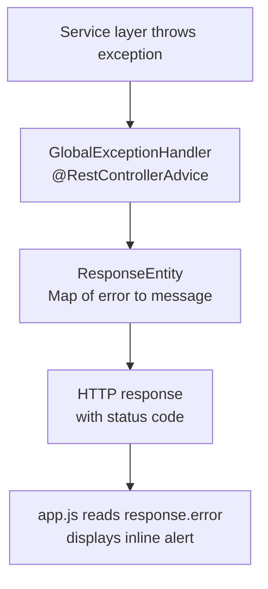

# Data Flow — Java File Upload Demo

This document traces every significant request path, data model, state mutation, and error propagation flow in the application. It is intended to supplement `ARCHITECTURE.md` with the runtime perspective: what happens to data as it moves through the layers.

---

## 2.1 Request and Event Lifecycle

### 2.1.1 Registration flow

**Entry point:** `POST /api/auth/register` — JSON body `{"username": "...", "password": "..."}`

1. Spring MVC dispatches to `AuthController.register` (`controller/AuthController.java`).
2. `@Valid` triggers Bean Validation on `RegisterRequest`. If `username` is blank or shorter than 3 characters, or `password` is blank or shorter than 6 characters, a `MethodArgumentNotValidException` is raised immediately; Spring MVC maps it to HTTP 400.
3. `AuthService.register` (`service/AuthService.java`) runs inside a `@Transactional` boundary.
   - `UserRepository.existsByUsername` issues a `SELECT EXISTS` query. If the username is taken, `IllegalArgumentException` is thrown → HTTP 400 via `GlobalExceptionHandler`.
   - A new `User` entity is constructed with the password BCrypt-hashed via `PasswordEncoder.encode`.
   - `UserRepository.save` persists the entity; Hibernate issues an `INSERT INTO users`.
   - `JwtService.generateToken` derives the HMAC-SHA256 signing key (SHA-256 of `app.jwt-secret`), builds a JWT with `sub=username`, `iat=now`, `exp=now+jwtExpirationMs`, and signs it.
   - An `AuthResponse(token, username, "ROLE_USER")` is returned.
4. The controller wraps it in `ResponseEntity.ok()` → HTTP 200 with JSON body.

**Data written:** One row inserted into `users`.  
**Data returned:** JWT token string, username, role name.

---

### 2.1.2 Login flow

**Entry point:** `POST /api/auth/login` — JSON body `{"username": "...", "password": "..."}`

1. Spring MVC dispatches to `AuthController.login`.
2. `@Valid` validates `LoginRequest` — both fields `@NotBlank`.
3. `AuthService.login` (`service/AuthService.java`) runs in `@Transactional`.
   - `UserRepository.findByUsername` queries the `users` table. If not found, throws `BadCredentialsException` (mapped to HTTP 401). The same exception type is used for "user not found" and "wrong password" to prevent username enumeration.
   - If the loaded `User.accountLocked == true`, throws `LockedException` (mapped to HTTP 423).
   - `AuthenticationManager.authenticate` is called with a `UsernamePasswordAuthenticationToken`. Internally: `UserDetailsServiceImpl.loadUserByUsername` re-loads the user from the database, then `DaoAuthenticationProvider` runs `BCryptPasswordEncoder.matches` to verify the password.
   - **On `BadCredentialsException`:** increments `user.failedAttempts`. If `failedAttempts >= app.max-login-attempts`, sets `user.accountLocked = true`. Calls `UserRepository.save`. Re-throws the exception — the `@Transactional` boundary ensures the counter is committed even though an exception is propagating.
   - **On success:** resets `user.failedAttempts = 0`, updates `UserRepository.save`. Generates a JWT from the `UserDetails` principal returned by `AuthenticationManager`. Returns `AuthResponse`.
4. HTTP 200 with the JWT body.

**Data read:** `users` table (twice — once in `AuthService`, once inside `AuthenticationManager`).  
**Data written:** `users.failed_attempts` (incremented on failure) or `users.failed_attempts = 0` (reset on success); `users.account_locked = true` at threshold.  
**Data returned:** JWT token string, username, role name.

---

### 2.1.3 Authenticated request filter (runs on every `/api/**` request)

Before any controller method is reached, `JwtAuthenticationFilter.doFilterInternal` (`security/JwtAuthenticationFilter.java`) executes:

1. Reads the `Authorization` header. If absent or not prefixed `Bearer `, calls `chain.doFilter` and returns immediately — the request proceeds unauthenticated.
2. Extracts the token string (characters after `Bearer `).
3. Calls `JwtService.extractUsername(jwt)`. On any `JwtException` (malformed, tampered, expired-signature), passes through unauthenticated.
4. If `username != null` and `SecurityContextHolder` has no existing authentication: loads `UserDetails` from `UserDetailsServiceImpl.loadUserByUsername` (database round-trip).
5. `JwtService.isValid(jwt, userDetails)` checks subject match and token expiry. If invalid, passes through unauthenticated.
6. If valid: constructs a `UsernamePasswordAuthenticationToken` with `userDetails.getAuthorities()`, attaches request details (remote IP, session ID placeholder), and sets it on `SecurityContextHolder`.
7. Calls `chain.doFilter` — the authenticated `Authentication` is now available in all downstream code.

**Data read:** `users` table (via `UserDetailsServiceImpl`) on every authenticated request, to pick up live role and lock state.

---

### 2.1.4 File upload flow

**Entry point:** `POST /api/files/upload` — multipart form data, field name `file`, with `Authorization: Bearer <token>`.

1. The JWT filter authenticates the request (see 2.1.3).
2. Spring MVC dispatches to `FileController.upload` (`controller/FileController.java`). `auth.getName()` returns the authenticated username.
3. `FileService.upload(file, username)` runs in `@Transactional` (`service/FileService.java`).
   - **Size check:** if `file.getSize() > app.max-file-size-mb * 1024 * 1024`, throws `IllegalArgumentException` → HTTP 400.
   - **Security validation:** calls `FileSecurityService.validateAndGetMimeType(file)` (`service/FileSecurityService.java`):
     a. Reads all bytes via `file.getBytes()` into memory.
     b. Calls `tika.detect(bytes, filename)` — Tika reads magic bytes and uses the filename as a tiebreaker to return a MIME type string.
     c. Extracts the extension from the filename. If the extension (lowercase) is in `BLOCKED_EXTENSIONS`, throws `FileSecurityException` → HTTP 422.
     d. If the detected MIME contains `"executable"` or equals `"application/x-msdownload"`, throws `FileSecurityException` → HTTP 422.
     e. If the detected MIME is `application/zip` or `application/x-zip-compressed`, calls `checkZipBomb(bytes, file.getSize())`:
        - Streams through the ZIP with `ZipInputStream`, counting actual decompressed bytes in an 8 KB buffer.
        - If total uncompressed bytes exceed 500 MB (checked incrementally), throws `FileSecurityException` → HTTP 422.
        - After streaming completes, if `uncompressed / compressedSize > 100`, throws `FileSecurityException` → HTTP 422.
     f. Returns the detected MIME type string.
   - **Filename sanitization:** `FileSecurityService.sanitizeFilename(originalFilename)` strips unsafe characters.
   - **UUID generation:** `UUID.randomUUID().toString()` is the on-disk filename.
   - **Disk write:** `Files.createDirectories(uploadDir)` (idempotent); `file.transferTo(target)` writes bytes to `<app.upload-dir>/<uuid>`.
   - **Owner lookup:** `UserRepository.findByUsername(username)` — loads the `User` entity.
   - **Metadata persist:** constructs `FileMetadata` (filename=UUID, originalFilename=sanitized, mimeType, size, storagePath=absolute path, owner, scanStatus=CLEAN), calls `FileMetadataRepository.save` → `INSERT INTO file_metadata`.
   - Maps entity to `FileMetadataDto` via `toDto()` and returns.
4. HTTP 200 with `FileMetadataDto` JSON.

**Data read:** `users` table (owner lookup).  
**Data written:** File written to `<upload-dir>/<uuid>`; one row inserted into `file_metadata`.  
**Data returned:** `FileMetadataDto` (id, originalFilename, mimeType, size, scanStatus, ownerUsername, createdAt).

---

### 2.1.5 Chunked file upload flow

**Entry point:** `app.js` determines the upload path at form submit time. Files with `size > CHUNK_THRESHOLD` (10 MB) are routed through the chunked path; files at or below the threshold use the single-request path described in 2.1.4.

#### Step 1 — Init session

**Endpoint:** `POST /api/files/upload/init` — JSON body `{filename, totalSize, totalChunks}`

1. JWT filter authenticates the request (see 2.1.3).
2. `ChunkedUploadController.initUpload` receives the `ChunkInitRequest` DTO and the authenticated `Authentication`.
3. Delegates to `ChunkedUploadService.initSession(filename, totalSize, totalChunks, username)`.
4. Service validates `totalSize` against `app.max-large-file-size-mb * 1024 * 1024`. If exceeded, throws `IllegalArgumentException` → HTTP 400.
5. `UUID.randomUUID()` generates the `uploadId` string.
6. A new `UploadSession` is constructed with `username`, `originalFilename`, `totalChunks`, `totalSize`, empty `HashSet<Integer> receivedChunks`, and `createdAt = Instant.now()`.
7. `Files.createDirectories(uploadDir.resolve("chunks").resolve(uploadId))` creates the isolated temp directory.
8. `session.tempDir` is set to this path; the session is inserted into `sessions` (`ConcurrentHashMap<String, UploadSession>`).
9. `ChunkInitResponse{uploadId}` is returned → HTTP 200.

**State created:** one `UploadSession` entry in the in-memory map; one temp directory on disk.

---

#### Step 2 — Upload individual chunks

**Endpoint:** `POST /api/files/upload/{uploadId}/chunk?chunkIndex=N` — multipart `chunk` field

1. JWT filter authenticates the request.
2. `ChunkedUploadController.uploadChunk` looks up the session by `uploadId` in `ChunkedUploadService`. If no session exists, throws `IllegalArgumentException` → HTTP 400.
3. Ownership check: `session.username.equals(auth.getName())`. If false, throws `AccessDeniedException` → HTTP 403.
4. The chunk bytes are written to `session.tempDir.resolve(String.valueOf(chunkIndex))`.
5. `chunkIndex` is added to `session.receivedChunks` (a `Set<Integer>` — duplicate chunk uploads for the same index overwrite the file, which is idempotent).
6. `ChunkUploadResponse{uploadId, session.receivedChunks.size(), session.totalChunks}` is returned → HTTP 200.
7. `app.js` updates `div#upload-progress-bar` width based on `chunksReceived / totalChunks`.

**State mutated:** one chunk file created on disk; `receivedChunks` set updated in the `UploadSession`.

---

#### Step 3 — Complete assembly

**Endpoint:** `POST /api/files/upload/{uploadId}/complete`

1. JWT filter authenticates the request.
2. `ChunkedUploadController.completeUpload` loads and ownership-verifies the session.
3. `ChunkedUploadService.completeUpload(uploadId, username)` verifies session completeness, then:
   a. Generates a final `UUID.randomUUID()` as the `storedName` (on-disk filename).
   b. Opens an `OutputStream` to `{upload-dir}/{storedName}`.
   c. Iterates chunk indexes `0` through `session.totalChunks - 1` in order; for each, copies the chunk file bytes into the output stream using `Files.copy`. Missing a chunk at this point would cause a `NoSuchFileException` → HTTP 500 via `GlobalExceptionHandler`.
   d. Closes the output stream. The assembled file is now at `{upload-dir}/{storedName}`.
   e. Calls `FileSecurityService.validateAndGetMimeType(assembledPath, session.originalFilename)`:
      - Extension check: same blocklist as single-request path.
      - `Tika.detect(assembledPath.toFile())` reads magic bytes from disk without loading the file into heap.
      - If ZIP MIME, calls `checkZipBomb(Files.newInputStream(assembledPath), Files.size(assembledPath))` — streams the decompressed bytes from disk with an 8 KB buffer.
      - Returns the detected MIME type string.
   f. On `FileSecurityException`: the assembled file is deleted from disk before re-throwing → HTTP 422.
   g. Calls `FileService.persistAssembledFile(storedName, storedPath, sanitizedOriginal, size, mimeType, username)` which: looks up the `User` entity, constructs `FileMetadata` with `scanStatus = CLEAN`, and calls `FileMetadataRepository.save` → `INSERT INTO file_metadata`.
   h. `FileSystemUtils.deleteRecursively(session.getTempDir())` deletes the temp directory and all chunk files; this runs in a `finally` block so it executes even if security validation fails.
   i. Session is removed from the `ConcurrentHashMap`.
4. `FileMetadataDto` is returned → HTTP 200.

**State destroyed:** temp directory and all chunk files deleted; `UploadSession` removed from map.
**State created:** assembled file at `{upload-dir}/{storedName}`; one row in `file_metadata`.

---

#### Abort

**Endpoint:** `DELETE /api/files/upload/{uploadId}`

1. JWT filter authenticates the request.
2. `ChunkedUploadController.abortUpload` loads and ownership-verifies the session.
3. `ChunkedUploadService.abortUpload(uploadId, username)` deletes the temp directory via `FileSystemUtils.deleteRecursively` and removes the session from the map.
4. Returns HTTP 204.

**State destroyed:** temp directory and any partial chunk files deleted; `UploadSession` removed from map.

---

### 2.1.6 File download flow

**Entry point:** `GET /api/files/{id}` with `Authorization: Bearer <token>`.

1. JWT filter authenticates the request.
2. `FileController.download` calls `isAdmin(auth)` to check `ROLE_ADMIN` in authorities.
3. `FileService.download(id, username, isAdmin)` (`service/FileService.java`):
   - Calls `findWithAccess(id, username, isAdmin)`:
     - `FileMetadataRepository.findById(id)` — queries `file_metadata` by primary key. If absent, throws `RuntimeException` → HTTP 500.
     - If `!isAdmin && meta.getOwner().getUsername() != username`, throws `AccessDeniedException` → HTTP 403.
   - Constructs `UrlResource` from `Paths.get(meta.getStoragePath()).toUri()`.
   - If the resource does not exist on disk, throws `RuntimeException` → HTTP 500.
   - Returns `FileDownloadResult(resource, originalFilename, mimeType)`.
4. Controller sets `Content-Disposition: attachment; filename="<originalFilename>"` and `Content-Type: <mimeType>` (falls back to `application/octet-stream` if null).
5. Returns `ResponseEntity.ok().headers(headers).body(resource)` — Spring streams the file bytes.

**Data read:** `file_metadata` row; file bytes from disk.  
**Data returned:** File bytes as response body.

---

### 2.1.7 File list flow (own files)

**Entry point:** `GET /api/files` with `Authorization: Bearer <token>`.

1. JWT filter authenticates the request.
2. `FileController.listMyFiles` calls `FileService.listForUser(username)`.
3. `FileMetadataRepository.findByOwnerUsername(username)` — Spring Data generates `SELECT f FROM FileMetadata f WHERE f.owner.username = ?1` (implicit join to `users`).
4. Each entity is mapped to `FileMetadataDto` via `FileService.toDto`. Note: `toDto` accesses `meta.getOwner().getUsername()`, which triggers a lazy load of the `User` association. This is safe because the list is fetched in a JPA session context.
5. Returns the list as JSON.

---

### 2.1.8 File list flow (admin — all files)

**Entry point:** `GET /api/files/all` with `Authorization: Bearer <token>` (must be `ROLE_ADMIN`).

1. `SecurityConfig` enforces `.requestMatchers("/api/files/all").hasRole("ADMIN")` — any non-admin request is rejected with HTTP 403 before reaching the controller.
2. `FileController.listAllFiles` calls `FileService.listAll()`.
3. `FileMetadataRepository.findAll()` — retrieves every row from `file_metadata`.
4. Maps to `FileMetadataDto` list and returns.

---

### 2.1.9 File delete flow

**Entry point:** `DELETE /api/files/{id}` with `Authorization: Bearer <token>`.

1. JWT filter authenticates.
2. `FileController.delete` calls `FileService.delete(id, username, isAdmin(auth))`.
3. `FileService.delete` in `@Transactional`:
   - `findWithAccess(id, username, isAdmin)` loads and checks ownership (same logic as download).
   - `Files.deleteIfExists(Paths.get(meta.getStoragePath()))` — removes the file from disk. No error if already gone.
   - `FileMetadataRepository.delete(meta)` — removes the row from `file_metadata`.
4. Returns HTTP 204 No Content.

**Data written/deleted:** File removed from disk; row deleted from `file_metadata`.

---

### 2.1.10 Page navigation (SPA)

**Entry point:** Browser navigates to `/`, `/login`, or `/register`.

1. `WebController` returns a Thymeleaf view name (`"index"`, `"login"`, `"register"`).
2. Thymeleaf resolves it to `templates/<name>.html` and serves the static HTML — no model data is injected.
3. For `/login` and `/register`: inline JavaScript handles form submit, calls the REST API, stores the JWT in `localStorage` (`jwt`, `username`, `role`), and redirects to `/`.
4. For `/` (index): `app.js` is loaded. On startup, it checks `localStorage.getItem('jwt')` — if absent, redirects to `/login`. Otherwise calls `loadFiles()` to populate the table via `GET /api/files`.

---

## 2.2 Data Models

### 2.2.1 `User` (`model/User.java`)

**Table:** `users`

| Field | Column | Type | Constraints | Description |
|---|---|---|---|---|
| `id` | `id` | `BIGINT` | PK, auto-increment | Surrogate primary key |
| `username` | `username` | `VARCHAR(50)` | UNIQUE, NOT NULL | Login name; 3–50 chars enforced at DTO level |
| `password` | `password` | `VARCHAR(100)` | NOT NULL | BCrypt hash; never the raw password |
| `role` | `role` | `VARCHAR(20)` | NOT NULL | `ROLE_USER` or `ROLE_ADMIN`; stored as enum name |
| `accountLocked` | `account_locked` | `BOOLEAN` | defaults false | Set true after `maxLoginAttempts` failures |
| `failedAttempts` | `failed_attempts` | `INT` | defaults 0 | Consecutive failed login count; reset on success |
| `lastLogin` | `last_login` | `TIMESTAMP` | nullable | Updated on each successful login |
| `createdAt` | `created_at` | `TIMESTAMP` | NOT NULL, immutable | Set at entity construction; `updatable=false` |

**Relationships:** One `User` to many `FileMetadata` (not mapped as a collection on `User`; navigated only from `FileMetadata.owner`).

**Lifecycle through requests:**
- Created by `AuthService.register`.
- Read by `UserDetailsServiceImpl` on every authenticated request.
- `failedAttempts` and `accountLocked` mutated by `AuthService.login`.

---

### 2.2.2 `FileMetadata` (`model/FileMetadata.java`)

**Table:** `file_metadata`

| Field | Column | Type | Constraints | Description |
|---|---|---|---|---|
| `id` | `id` | `BIGINT` | PK, auto-increment | Surrogate primary key |
| `filename` | `filename` | `VARCHAR` | NOT NULL | UUID on-disk name; never shown to users |
| `originalFilename` | `original_filename` | `VARCHAR` | NOT NULL | Sanitized user-supplied name; used for display and `Content-Disposition` |
| `mimeType` | `mime_type` | `VARCHAR` | nullable | Tika-detected MIME type (e.g. `text/plain`) |
| `size` | `size` | `BIGINT` | — | File size in bytes |
| `storagePath` | `storage_path` | `VARCHAR` | — | Absolute path to the UUID file on disk |
| `owner` | `owner_id` (FK) | `BIGINT` | NOT NULL, FK → `users.id` | Lazy-fetched; `FETCH = LAZY` |
| `scanStatus` | `scan_status` | `VARCHAR` | — | `PENDING`/`CLEAN`/`INFECTED`/`FAILED`; stored as enum name |
| `createdAt` | `created_at` | `TIMESTAMP` | NOT NULL, immutable | Set at construction; `updatable=false` |

**Relationships:** `ManyToOne` to `User` via `owner_id`. Fetched lazily; code that accesses `owner.username` must do so within a transaction or after eager loading.

**Lifecycle through requests:**
- Created by `FileService.upload`.
- Read by `FileMetadataRepository.findByOwnerUsername` and `findById`.
- Deleted by `FileService.delete`.
- `scanStatus` is always `CLEAN` in the current implementation; intended to be `PENDING` once async scanning is wired.

---

### 2.2.3 `Role` enum (`model/Role.java`)

Two constants: `ROLE_USER`, `ROLE_ADMIN`. Stored as enum name string in `users.role`. The `ROLE_` prefix is mandatory for Spring Security's `hasRole("ADMIN")` authorization expressions.

---

### 2.2.4 `ScanStatus` enum (`model/ScanStatus.java`)

Four constants: `PENDING`, `CLEAN`, `INFECTED`, `FAILED`. Stored as enum name string in `file_metadata.scan_status`. Intended lifecycle: `PENDING` → (async scan) → `CLEAN` or `INFECTED` or `FAILED`. Currently all uploads are set directly to `CLEAN`.

---

### 2.2.5 `UploadSession` (`service/UploadSession.java`)

In-memory POJO (not a JPA entity, not persisted) representing one in-progress chunked upload. Held in `ChunkedUploadService.sessions` (`ConcurrentHashMap<String, UploadSession>`).

| Field | Type | Description |
|---|---|---|
| `uploadId` | `String` | UUID string; map key; returned to client in `ChunkInitResponse` |
| `username` | `String` | Authenticated username who initiated the session; enforced on every subsequent request |
| `originalFilename` | `String` | Raw filename from `ChunkInitRequest`; sanitized before use in `FileMetadata` |
| `totalChunks` | `int` | Declared chunk count from the client; used to drive assembly loop |
| `totalSize` | `long` | Declared total file size in bytes; validated against `app.max-large-file-size-mb` at init |
| `receivedChunks` | `Set<Integer>` | Indexes of chunks written to disk; used to report progress |
| `tempDir` | `Path` | Absolute path to `{upload-dir}/chunks/{uploadId}/`; chunk files live here |
| `createdAt` | `Instant` | Session creation timestamp; intended for TTL-based cleanup (no cleanup job exists yet) |

**Lifecycle:** created by `ChunkedUploadService.initSession`; mutated by each `receiveChunk` call (via `uploadChunk`); destroyed by `completeUpload` (on complete) or `abortUpload` (on abort). Never persisted — lost on application restart.

---

### 2.2.6 DTOs

| DTO | Direction | Purpose |
|---|---|---|
| `RegisterRequest` | Inbound | `POST /api/auth/register` body; carries `@Valid` constraints |
| `LoginRequest` | Inbound | `POST /api/auth/login` body; carries `@Valid` constraints |
| `AuthResponse` | Outbound | Returned by both auth endpoints; contains JWT, username, role |
| `FileMetadataDto` | Outbound | Public projection of `FileMetadata`; omits `filename` (UUID) and `storagePath` |
| `FileDownloadResult` | Internal (record) | Carries `Resource`, `originalFilename`, `mimeType` from `FileService` to `FileController` |
| `ChunkInitRequest` | Inbound | `POST /api/files/upload/init` body; carries `filename`, `totalSize` (bytes), `totalChunks` |
| `ChunkInitResponse` | Outbound | Response to init; carries `uploadId` UUID string for subsequent chunk/complete/abort calls |
| `ChunkUploadResponse` | Outbound | Response to each chunk upload; carries `uploadId`, `chunksReceived` (current count), `totalChunks` (used by frontend to update the progress bar) |

---

## 2.3 State Management

### 2.3.1 Database state

**H2 (dev):** In-memory database `jdbc:h2:mem:fileuploaddb`. DDL is auto-generated by Hibernate (`create-drop`): schema is created on startup and dropped on shutdown. All data is lost when the application stops.

**PostgreSQL (prod):** Persistent database. DDL is `validate` — Hibernate checks that the schema matches the entity model but does not make changes. Schema must be set up via a migration tool (not currently included in the project; a future addition should add Flyway or Liquibase migrations).

**Tables:** `users`, `file_metadata`. No explicit DDL scripts exist; in dev, Hibernate generates the schema from entity annotations.

**Key indexes/constraints:**
- `users.username` — UNIQUE constraint (enforced by `@Column(unique = true)` and application-level check).
- `file_metadata.owner_id` — foreign key to `users.id`.

---

### 2.3.2 Filesystem state

Completed files are stored under `app.upload-dir` (default `./uploads`). Each file is named by its UUID string (no extension). The directory is created on first upload if it does not exist (`Files.createDirectories`). The absolute path is stored in `file_metadata.storage_path`.

**Chunked upload temp state:** In-progress chunked uploads write individual chunk files to `{upload-dir}/chunks/{uploadId}/{chunkIndex}`. This subdirectory tree is created at session init and deleted entirely (recursively) on successful assembly or abort. If the JVM exits or crashes while a chunked upload is in progress, the temp directory and its chunk files are orphaned on disk with no cleanup mechanism.

**Dev test state:** Integration tests redirect uploads to `./target/test-uploads` via `@TestPropertySource`. This directory is cleaned by `mvn clean`.

**Orphan risk:** Two orphan scenarios exist: (1) for single-request uploads, if `FileMetadataRepository.save` fails after `file.transferTo`, the assembled file is orphaned; (2) for chunked uploads, a JVM crash between assembly and the `FileSystemUtils.deleteRecursively` cleanup step (in the `finally` block) orphans the assembled file; a crash before assembly completes orphans the temp directory. No automated cleanup mechanism covers either case.

---

### 2.3.3 In-memory / request-scoped state

**`SecurityContextHolder`:** Holds the current `Authentication` (a `UsernamePasswordAuthenticationToken`) for the duration of the request. Cleared at the end of each request thread. Because session policy is `STATELESS`, this is never persisted.

**`ChunkedUploadService.sessions` (`ConcurrentHashMap<String, UploadSession>`):** A JVM-lifetime singleton map holding one `UploadSession` per in-progress chunked upload. Entries are added at init and removed on complete or abort. This is the only application-level server-side state that survives across requests. It is scoped to the single JVM instance — a second application node would have its own independent map. If the application restarts, all sessions are lost and in-progress uploads must restart.

**JWT storage (client side):** The JWT, username, and role are stored in `localStorage` on the browser. This is client state, not server state. The server is stateless between requests except for the upload session map described above.

---

### 2.3.4 No other server-side session or cache state

The application does not use `HttpSession`, Spring Cache, or Redis. Outside of the chunked upload session map, every request is authenticated independently from the JWT. There is no application-level cache.

---

## 2.4 Async and Background Flows

### 2.4.1 Scan endpoint (stub — not yet async)

**Current behavior:** `GET /api/files/scan/{id}` calls `FileService.getMeta` and returns the current metadata unchanged. No actual scan is performed.

**Intended future behavior:**
- **Trigger:** A `POST` to `scan/{id}` (or automatically after upload) should submit the file to a ClamAV daemon via its Unix socket or network socket.
- **Async mechanism:** Spring `@Async` or an `ApplicationEvent` published from `FileService.upload` — a listener calls ClamAV and updates `scanStatus`.
- **Result surfacing:** The scan endpoint returns the current `scanStatus`. Clients poll or use WebSocket/SSE for live status; alternatively the UI shows a spinner while `scanStatus == PENDING`.
- **Error handling:** ClamAV timeouts or failures should set `scanStatus = FAILED`, not leave it `PENDING` indefinitely. A scheduled job could retry `FAILED` scans.

### 2.4.2 Stale upload session cleanup (not yet implemented)

**Trigger:** Should fire on a fixed interval (e.g., every 15 minutes) via `@Scheduled`.

**Intended behavior:** Iterate `ChunkedUploadService.sessions`; for each `UploadSession` where `Instant.now()` is more than a configurable TTL (e.g., 24 hours) beyond `session.getCreatedAt()`, call `abortUpload(uploadId, session.getUsername())` to delete the temp directory and remove the entry from the map.

**Why it does not exist yet:** `UploadSession.createdAt` is populated but no `@Scheduled` method reads it. This is flagged as technical debt in `DESIGN.md`. The consequence is that abandoned in-progress uploads accumulate in both the in-memory map and the filesystem until the application is restarted.

### 2.4.3 No other background flows

The application has no other scheduled tasks (`@Scheduled`), no message queue consumers, and no Spring Batch jobs.

---

## 2.5 Error and Exception Flows

### 2.5.1 Error type taxonomy

| Exception | Where thrown | Handler | HTTP status | Client message |
|---|---|---|---|---|
| `MethodArgumentNotValidException` | Spring MVC (Bean Validation) | Spring default | 400 | Field-level constraint details |
| `IllegalArgumentException` | `AuthService.register` (duplicate user), `FileService.upload` (size limit) | `GlobalExceptionHandler.handleIllegalArg` | 400 | Exception message |
| `BadCredentialsException` | `AuthService.login` | `GlobalExceptionHandler.handleBadCredentials` | 401 | `"Invalid credentials"` (generic, intentional) |
| `LockedException` | `AuthService.login` | `GlobalExceptionHandler.handleLocked` | 423 | `"Account is locked..."` |
| `AccessDeniedException` | `FileService.findWithAccess` | `GlobalExceptionHandler.handleAccessDenied` | 403 | `"Access denied"` |
| `FileSecurityException` | `FileSecurityService` | `GlobalExceptionHandler.handleFileSecurity` | 422 | Specific rejection reason |
| `UsernameNotFoundException` | `UserDetailsServiceImpl`, `FileService.upload` | Falls through to `RuntimeException` handler | 500 | Exception message |
| `RuntimeException` (catch-all) | `FileService.findWithAccess` (not found), `FileService.download` (missing on disk) | `GlobalExceptionHandler.handleRuntime` | 500 | Raw exception message — **information disclosure risk** |

### 2.5.2 Propagation path

### 2.5.3 Logging

The application does not include explicit logging configuration. Spring Boot's default Logback setup logs at `INFO` level to stdout. `JpaRepositories` SQL logging is disabled (`spring.jpa.show-sql=false`). No SLF4J logger fields exist in the application code — exceptions are surfaced to clients but not logged server-side. This is a gap for production: failed logins, security rejections, and access-denied events should be logged for monitoring.

### 2.5.4 Spring Security error responses

Requests that reach the security layer before the controller (unauthenticated requests to protected routes, non-admin requests to `/api/files/all`) return Spring Security's default error responses. These return HTML error pages by default in Spring Boot, not JSON. For a pure JSON API, a custom `AuthenticationEntryPoint` and `AccessDeniedHandler` should be configured in `SecurityConfig`.

---

## 2.6 External Data Flows

### 2.6.1 Apache Tika (local library, not an external service)

Apache Tika (`tika-core`) is used in-process. It reads file bytes from memory and returns a MIME type string. No network calls are made. No external service is involved.

**Data sent to Tika:** File bytes (`byte[]`) and the original filename string (used as a detection hint).  
**Data received from Tika:** MIME type string (e.g. `"text/plain"`, `"application/pdf"`).  
**Failure modes:** Tika is designed to be non-throwing for unusual file content — it falls back to `"application/octet-stream"` rather than raising exceptions for unrecognized formats.

---

### 2.6.2 H2 database (embedded, dev only)

H2 runs in-process as an in-memory database. No network socket is involved. The H2 web console at `/h2-console` is enabled in dev and accepts connections from the browser to the same JVM.

---

### 2.6.3 PostgreSQL (prod, external)

**Outbound data:** SQL queries (parameterized JPQL → SQL) for `INSERT`, `SELECT`, `UPDATE`, `DELETE` on `users` and `file_metadata`.  
**Inbound data:** Query result sets.  
**Authentication:** Username/password from `${DB_USERNAME}` and `${DB_PASSWORD}` environment variables.  
**Failure modes:** Connection failures surface as `DataAccessException` from Spring Data, which is an unchecked exception. It would propagate to `GlobalExceptionHandler.handleRuntime` → HTTP 500. No retry or circuit-breaker logic exists.

---

### 2.6.4 Bootstrap CDN (browser-side only)

`index.html`, `login.html`, and `register.html` load Bootstrap CSS from `https://cdn.jsdelivr.net/npm/bootstrap@5.3.0/dist/css/bootstrap.min.css`. This is a browser-to-CDN request — no server-side network call. If the CDN is unavailable, the UI loses styling but functionality is unaffected.

---

### 2.6.5 ClamAV (not yet integrated)

Intended future integration — no code exists today. See section 2.4.1 for the intended data flow when implemented.
