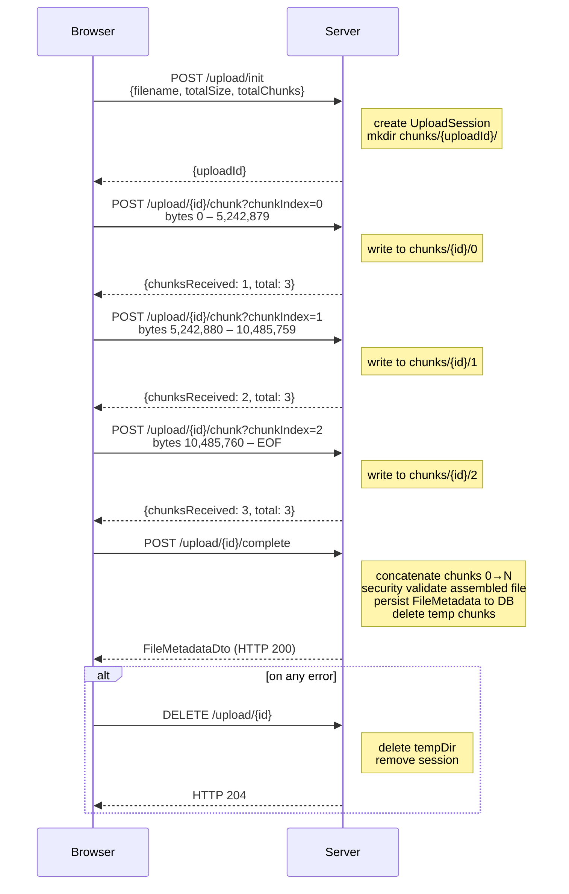
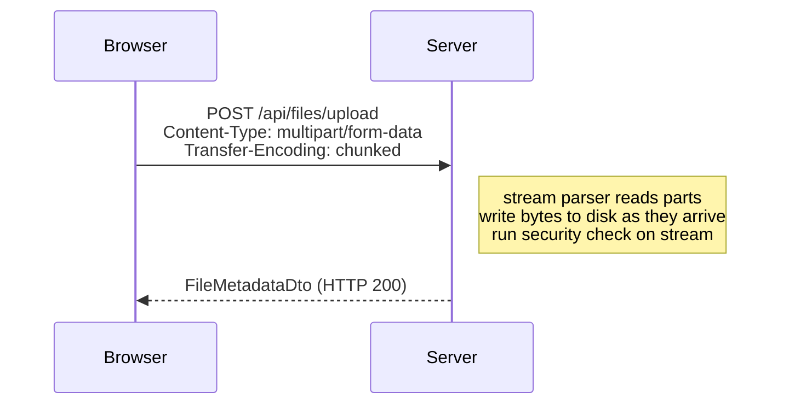
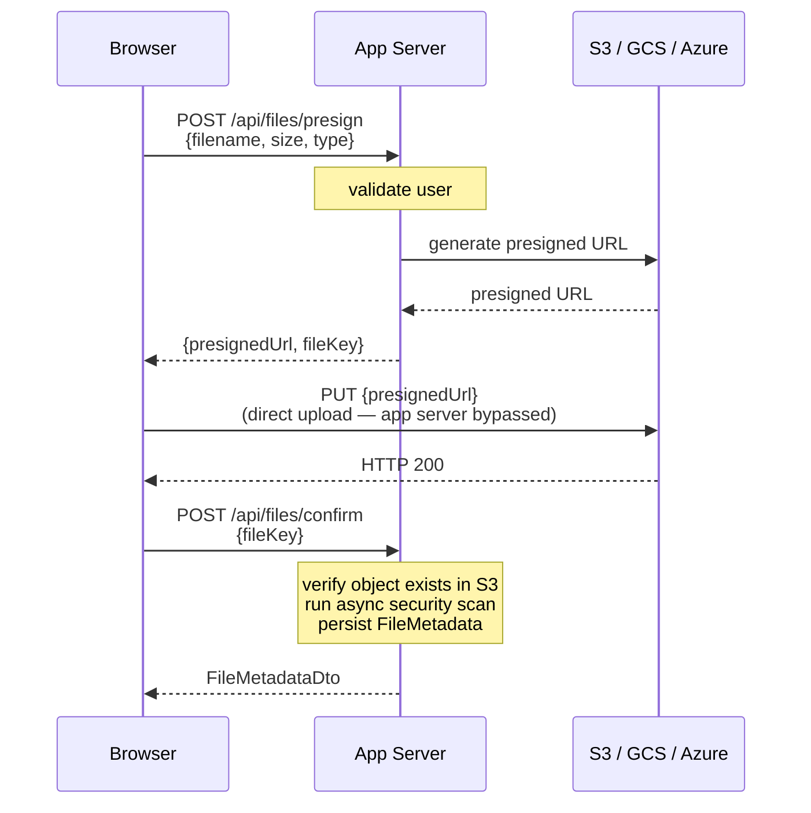
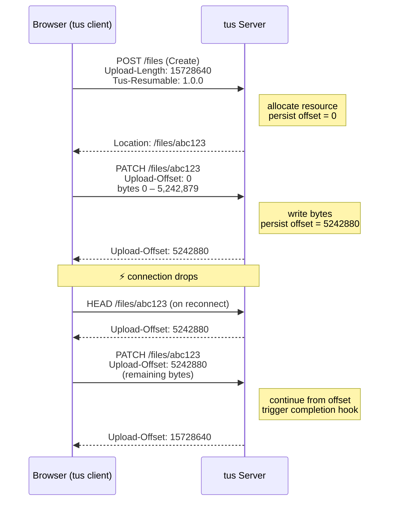
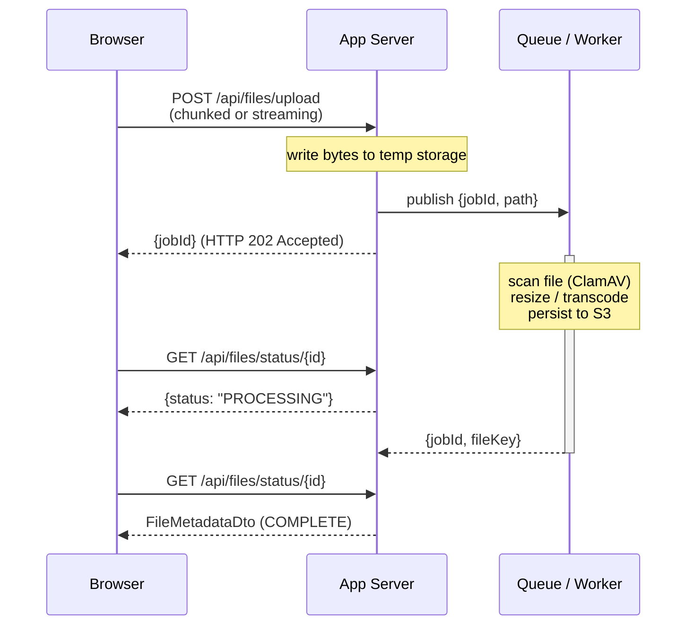
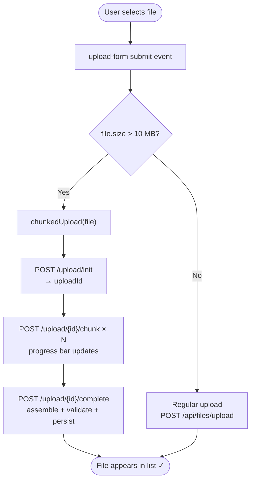

# Large File Uploads — Approaches, Rationale, and Implementation

This document covers the problem of uploading large files over HTTP: why a single multipart
request is insufficient at scale, the five main architectural approaches available, and how
each compares in terms of reliability, complexity, and operational cost. It then traces the
specific approach implemented in this project — client-side chunking — in full step-by-step
detail.

---

## 1. The Problem with Single-Request Uploads

A standard `multipart/form-data` upload works well for small files, but breaks down as file
size grows:

| Problem | Why it happens | Threshold where it starts mattering |
|---|---|---|
| **Memory pressure** | The entire request body is buffered in server memory (or a temp file) before the application sees it | > 50–100 MB |
| **Timeout failures** | HTTP proxies, load balancers, and CDNs impose request timeout limits (30s–5 min is common) | > ~50 MB on slow connections |
| **No resume on failure** | A network drop mid-upload means starting over from 0 bytes | Any large file on unreliable connections |
| **Client memory limits** | Browser enforces memory limits when reading the file into a `FormData` or `ArrayBuffer` | Browser-specific; noticeable above 500 MB |
| **Progress visibility** | `fetch()` and `XMLHttpRequest` do not provide reliable per-byte progress on the response side | — |
| **Load balancer request size limits** | AWS ALB: 1 MB default; nginx: `client_max_body_size`; most reverse proxies have limits | Varies by infrastructure |

Spring Boot itself adds two overlapping limits: `spring.servlet.multipart.max-file-size`
and `spring.servlet.multipart.max-request-size`. Both default to `1 MB` out of the box
(overridden to `10 MB` in this project). Raising these limits alone does not solve the
timeout, resume, or progress problems.

---

## 2. The Five Main Approaches

### 2.1 Client-Side Chunking *(implemented in this project)*

The file is split into fixed-size pieces in the browser using the `File.slice()` API. Each
piece is sent as a separate HTTP request. The server holds session state (which chunks have
arrived) and assembles the complete file once all chunks are confirmed.



**How it is implemented here:**

- **Frontend threshold:** `CHUNK_THRESHOLD = 10 MB`. Files at or below this use the
  existing `POST /api/files/upload` endpoint unchanged. Files above it enter the chunked
  path automatically — the submit handler branches on `file.size > CHUNK_THRESHOLD`.
- **Chunk size:** `CHUNK_SIZE = 5 MB`. Each chunk is `file.slice(i * CHUNK_SIZE, (i+1) * CHUNK_SIZE)`.
- **Session state:** `ChunkedUploadService` holds an in-memory `ConcurrentHashMap<String, UploadSession>`.
  Each `UploadSession` records the owner username, total chunk count, a `ConcurrentHashSet`
  of received chunk indices, and the path to the temporary directory.
- **Temp storage:** Chunks are written to `{upload-dir}/chunks/{uploadId}/{chunkIndex}` on the
  server filesystem. Each chunk file is named by its zero-based index.
- **Assembly:** `POST /upload/{id}/complete` iterates chunk indices 0 → N−1 and appends each
  to a new UUID-named file under `upload-dir` using `Files.copy(chunkPath, outputStream)`.
- **Security validation:** The assembled file is passed through `FileSecurityService.validateAndGetMimeType(Path, String)`, a streaming overload that uses `Tika.detect(File)` for MIME detection and `Files.newInputStream` for zip-bomb scanning — neither loads the full file into heap memory.
- **Cleanup:** The temp chunk directory is always deleted in a `finally` block on both
  success and failure. The `UploadSession` is removed from the map.
- **Abort path:** The client calls `DELETE /upload/{id}` on any network or server error.
  This deletes the temp directory and removes the session.

**Strengths:**
- Each individual HTTP request is small (5 MB), well within proxy and load balancer limits.
- The progress bar is accurate: `(chunksReceived / totalChunks) * 100%`.
- Partial uploads are recoverable: if the browser knows which chunks succeeded, it can
  retry only the failed ones (the current implementation retries from the beginning; adding
  chunk-level retry requires persisting `receivedChunks` across page reloads).
- Works in all browsers that support the `File` API (all modern browsers).
- No external dependencies: works with any HTTP server.

**Weaknesses:**
- Session state is in-memory. Restarting the server loses all in-progress sessions. A
  multi-server deployment needs a shared store (Redis, database) or sticky routing.
- Stale sessions (client abandoned mid-upload) are never cleaned up in the current
  implementation. A scheduled cleanup job should be added for production.
- The assembled file is created by sequential `Files.copy` calls. This is correct but not
  the fastest possible approach (random-access file channels would be faster for parallel
  chunk uploads).
- Security validation runs only on the complete assembled file, not on individual chunks.
  A compromised chunk that passes individually but triggers a violation when combined with
  others is rejected at complete-time — which is correct, but means temp disk space is held
  until completion.

---

### 2.2 Streaming Single-Request Upload

Instead of splitting the file, the client sends one large `multipart/form-data` request
and the server reads the body as a stream, writing bytes to disk without buffering the full
content in memory.



**How to implement in Spring Boot:**

Replace `@RequestParam("file") MultipartFile` with a manual `HttpServletRequest` and
stream the body using Apache Commons FileUpload's streaming API:

```java
// In the controller
ServletFileUpload upload = new ServletFileUpload();
FileItemIterator iter = upload.getItemIterator(request);
while (iter.hasNext()) {
    FileItemStream item = iter.next();
    try (InputStream stream = item.openStream()) {
        // write stream to disk incrementally
        Files.copy(stream, targetPath);
    }
}
```

Or use Spring's `StandardServletMultipartResolver` with `MultipartFile.getInputStream()` —
but note that by the time `getInputStream()` is called the file is already on a temp disk
location, so memory pressure is avoided but the double-copy (temp → final) still occurs.

**Strengths:**
- Simple from the client's perspective: one standard `multipart/form-data` POST.
- No session management overhead.
- Works with any HTTP client, curl, programmatic clients — no chunking logic required.
- Bytes hit disk immediately; the server's memory footprint stays flat regardless of file
  size.

**Weaknesses:**
- **No resume on failure.** If the connection drops at byte 800 MB of a 1 GB file, the
  upload starts over from 0.
- **Timeout risk remains.** A slow client uploading 2 GB at 1 Mbps takes 17 minutes.
  Most reverse proxies will close the connection.
- **Progress is harder to report.** The server can read the `Content-Length` header and
  track bytes consumed, but reporting progress back to the client requires a separate
  polling endpoint or a WebSocket.
- **Security scanning on a stream is constrained.** Tika can detect MIME type from the
  first few KB of a stream, but a full zip-bomb scan requires reading the entire archive.
  The current `FileSecurityService` already loads the full file for zip-bomb checks — for a
  streaming approach this must be done in a bounded way.
- **Load balancer / reverse proxy limits.** Nginx's `client_max_body_size` and AWS ALB's
  60-second idle timeout are still active. The server team must coordinate infrastructure
  changes.

**When to choose:** Internal tools where reliability is high and files are moderately large
(100–500 MB), clients are controlled (no browser), and simplicity is paramount.

---

### 2.3 Direct-to-Cloud Upload via Presigned URLs

The server does not handle the file bytes at all. Instead, it generates a short-lived
presigned URL to a cloud storage bucket (S3, GCS, Azure Blob) and returns it to the
client. The browser uploads directly to the bucket. The server is notified via a webhook
or polling once the upload completes.



**Strengths:**
- **Unlimited file size.** S3 supports single-request uploads up to 5 GB; S3 Multipart Upload
  supports up to 5 TB.
- **App server is not in the upload path.** CPU, memory, and bandwidth are not consumed by
  large transfers. The app server only handles small JSON requests.
- **Built-in reliability.** Cloud providers guarantee durability (99.999999999% for S3).
- **Native CDN integration.** Files can be served directly from CloudFront / Cloud CDN
  without routing through the application.
- **SDK support.** AWS SDK, GCP client libraries, and Azure SDK all provide presigned URL
  generation and Multipart Upload APIs with built-in retry.

**Weaknesses:**
- **External dependency.** Requires a cloud account, bucket policy, CORS configuration, and
  IAM/service-account credentials. Not viable for on-premises deployments.
- **Security scanning complexity.** The app server cannot inspect bytes that bypass it. You
  must either scan via a Lambda/Cloud Function triggered by an S3 event, or download the
  object server-side after the confirm step — reintroducing bandwidth cost.
- **Two-phase commit problem.** Between the client confirming upload and the server
  persisting metadata, the object in S3 has no owner. A crash in the confirm endpoint
  leaves orphaned objects. This requires a cleanup job (S3 lifecycle rule) and idempotent
  confirm logic.
- **CORS configuration required.** The bucket must allow the browser's origin to issue
  `PUT` requests with the appropriate content headers.
- **Cost.** S3 PUT requests and storage cost money. For a high-volume service this is
  expected; for small deployments it adds operational overhead.

**When to choose:** Production applications storing files long-term at scale, where cloud
infrastructure is already in use and file serving via CDN is desired.

---

### 2.4 Resumable Upload Protocol (tus.io)

`tus` (https://tus.io) is an open HTTP-based protocol designed specifically for resumable
uploads. The client sends `PATCH` requests with byte-range headers. The server tracks the
upload offset persistently. If the connection drops, the client queries the current offset
and resumes from that point.



**Strengths:**
- **True resume.** After any interruption — browser close, network drop, device sleep — the
  upload can be resumed from the exact byte it stopped at.
- **Open standard.** Client libraries exist for JavaScript (`tus-js-client`), iOS, Android,
  Java, and Python. Multiple server implementations are available (Go `tusd`, Java
  `tus-java-server`, Spring integration).
- **Protocol-level checksums.** The `Upload-Checksum` extension validates each PATCH with a
  checksum, detecting corruption in transit.
- **Concatenation extension.** Multiple parallel uploads can be concatenated server-side,
  enabling parallel chunk upload — faster than sequential chunking.

**Weaknesses:**
- **Protocol overhead.** The `HEAD` → `PATCH` → `HEAD` dance requires implementing and
  hosting a tus-compatible server endpoint. This is more complex than a simple REST API.
- **Persistent offset storage.** The server must persist the current byte offset across
  requests and across restarts. An in-memory map is not enough; a database or Redis store
  is needed.
- **Non-standard HTTP.** `PATCH` with custom headers and a `tus` negotiation handshake is
  unfamiliar to developers expecting a standard REST API. Debugging requires tus-aware
  tooling.
- **External library dependency.** Using `tus-java-server` adds a dependency. Implementing
  the protocol from scratch is non-trivial.

**When to choose:** Consumer-facing applications where files are uploaded over unreliable
mobile or public Wi-Fi networks, or when files are very large (> 1 GB) and the cost of
re-uploading from scratch is unacceptable.

---

### 2.5 Asynchronous Queue-Based Upload

The file (or a reference to it) is handed off to a message queue (RabbitMQ, Kafka, SQS).
A separate worker service consumes the message and processes the file (stores it, scans it,
transforms it). The HTTP response is returned immediately with a `202 Accepted` and a job
ID; the client polls or receives a webhook when processing completes.



**Strengths:**
- **Decoupled processing.** Heavy operations (virus scanning, image transcoding, PDF
  extraction) run asynchronously without blocking the HTTP thread or response time.
- **Back-pressure and rate limiting.** The queue absorbs upload bursts; workers scale
  independently.
- **Retry semantics.** If a worker crashes during processing, the message remains in the
  queue (or moves to a dead-letter queue) and is reprocessed.
- **Enables parallel pipelines.** Multiple consumers can run different operations on the
  same file concurrently (scan + transcode + thumbnail generation).

**Weaknesses:**
- **Complexity.** Requires a message broker, a separate worker process or thread pool, a
  status polling endpoint (or WebSocket/SSE for push), and idempotent message handling.
- **Eventual consistency.** The client must handle the `202 → polling → complete` lifecycle.
  UI design is more complex.
- **Not a standalone upload mechanism.** The file still needs to be transferred to the
  server by one of the other approaches (chunking, streaming, or presigned URL). The queue
  handles post-transfer processing, not the transfer itself.

**When to choose:** When post-upload processing (scanning, transformation, indexing) is
expensive and must not block the HTTP response. Typically combined with approach 2.3
(direct-to-cloud) where an S3 event triggers the queue.

---

## 3. Comparison Matrix

| Criterion | 2.1 Client chunking *(this project)* | 2.2 Streaming single-request | 2.3 Presigned URL (cloud) | 2.4 tus resumable | 2.5 Async queue |
|---|---|---|---|---|---|
| **Max practical file size** | ~2 GB (configurable) | ~500 MB (proxy limits) | 5 TB (S3 Multipart) | Unlimited | Depends on other approach used |
| **Resume on failure** | Partial (retries from chunk 0 in this impl.) | No | Via S3 Multipart | Yes (byte-exact) | No |
| **Upload progress** | Yes (per-chunk) | Only via polling | Yes (XHR progress) | Yes | No (processing only) |
| **Infrastructure complexity** | Low (stateful in-process) | Low | High (cloud + CORS + IAM) | Medium (tus server + persistent state) | High (broker + workers) |
| **App server in data path** | Yes | Yes | No | Yes | Depends |
| **External dependencies** | None | None | Cloud provider SDK | tus library | Message broker |
| **Handles unreliable networks** | Partially | No | Partially | Yes | No |
| **Security scan placement** | Assembled file (server) | Streaming (server) | Post-upload (async) | Assembled file (server) | Async (worker) |
| **Load-balancer-safe** | Requires shared session state | Yes | Yes | Requires shared offset state | Yes |
| **Implementation effort** | Medium | Low | High | High | High |

---

## 4. Why Client-Side Chunking Was Chosen for This Project

This project is a self-contained Spring Boot demo with no external dependencies beyond the
JVM. The selection criteria were:

1. **No cloud or broker dependency.** The app must run locally with `./mvnw spring-boot:run`
   and nothing else. Approaches 2.3 and 2.5 require external services.

2. **Visible progress in the browser.** A progress bar was a desired UX feature. Approach 2.2
   (streaming) cannot report per-byte progress without a polling endpoint.

3. **Simple infrastructure.** The demo does not run behind a load balancer, so the shared
   session-state limitation of chunking (2.1) is not a concern.

4. **Acceptable file size ceiling.** A 2 GB limit (`app.max-large-file-size-mb=2048`) covers
   the vast majority of practical use cases for a demo. Approach 2.4 (tus) is a strict
   upgrade for true resume capability, but adds protocol and library overhead not warranted
   here.

5. **Security validation on the complete file.** The existing `FileSecurityService` (extension
   block, Tika MIME detection, zip-bomb check) was designed to work on a complete file.
   Approach 2.2 could stream to disk first and then validate, but approach 2.1 makes the
   two-phase design (store chunks, validate assembled) explicit and auditable.

6. **Incremental delivery.** Client-side chunking is easy to understand, easy to test (the
   `large-sample.bin` in `samples/valid/` exercises it), and easy to extend toward approach
   2.4 by swapping the in-memory session map for a database-backed one and adding per-chunk
   checksum headers.

---

## 5. Detailed Implementation Flow

This section traces the complete lifecycle of a large file upload in the current codebase,
from the moment the user clicks Upload to the moment the file appears in the file list.

### 5.1 Browser detection and branching (`app.js`)



Constants used:
- `CHUNK_THRESHOLD = 10 * 1024 * 1024` (10 MB) — must match `app.max-file-size-mb`
- `CHUNK_SIZE = 5 * 1024 * 1024` (5 MB) — must match `app.chunk-size-mb`
- `totalChunks = Math.ceil(15728640 / 5242880)` = **3**

### 5.2 Session initialisation

```
POST /api/files/upload/init
Authorization: Bearer <token>
Content-Type: application/json
{ "filename": "large-sample.bin", "totalSize": 15728640, "totalChunks": 3 }
```

**Server path:**
```
ChunkedUploadController.init()
  └── ChunkedUploadService.initSession(username, "large-sample.bin", 15728640, 3)
        ├── Validate totalSize ≤ app.max-large-file-size-mb (2048 MB) ✓
        ├── Validate totalChunks > 0 ✓
        ├── Generate uploadId = UUID.randomUUID()  →  e.g. "a1b2c3d4-..."
        ├── Create directory: {upload-dir}/chunks/a1b2c3d4-.../ (Files.createDirectories)
        ├── Construct UploadSession {
        │     uploadId: "a1b2c3d4-..."
        │     username: "alice"
        │     originalFilename: "large-sample.bin"
        │     totalChunks: 3
        │     totalSize: 15728640
        │     receivedChunks: [] (empty ConcurrentHashSet)
        │     tempDir: ./uploads/chunks/a1b2c3d4-.../
        │     createdAt: Instant.now()
        │   }
        └── sessions.put("a1b2c3d4-...", session)
```

**Response:** `{ "uploadId": "a1b2c3d4-..." }` (HTTP 200)

Progress bar becomes visible at 0%.

### 5.3 Chunk upload loop

For `i = 0, 1, 2`:

```javascript
const start = i * CHUNK_SIZE;                         // 0, 5242880, 10485760
const end   = Math.min(start + CHUNK_SIZE, file.size); // 5242880, 10485760, 15728640
const chunk = file.slice(start, end);                 // Blob, no copy into memory
```

```
POST /api/files/upload/a1b2c3d4-.../chunk?chunkIndex=0
Content-Type: multipart/form-data; boundary=...
Authorization: Bearer <token>
[body: 5,242,880 bytes]
```

**Server path (per chunk):**
```
ChunkedUploadController.uploadChunk(uploadId, chunkIndex=0, chunkData, auth)
  └── ChunkedUploadService.receiveChunk("a1b2c3d4-...", 0, chunk, "alice")
        ├── getSessionForUser() — verify session exists, verify owner == "alice"
        ├── Validate 0 ≤ chunkIndex < 3 ✓
        ├── chunkData.transferTo(./uploads/chunks/a1b2c3d4-.../0)
        └── session.receivedChunks.add(0)  →  size: 1
```

**Response:** `{ "uploadId": "...", "chunksReceived": 1, "totalChunks": 3 }` (HTTP 200)

After each response, the progress bar advances:
- chunk 0 done → `Math.round((1/3) * 90)` = **30%**
- chunk 1 done → `Math.round((2/3) * 90)` = **60%**
- chunk 2 done → `Math.round((3/3) * 90)` = **90%**

### 5.4 Completion — assembly and validation

```
POST /api/files/upload/a1b2c3d4-.../complete
Authorization: Bearer <token>
```

**Server path:**
```
ChunkedUploadController.complete(uploadId, auth)
  └── ChunkedUploadService.completeUpload("a1b2c3d4-...", "alice")
        │
        ├── getSessionForUser() — verify session and owner
        ├── session.isComplete()? receivedChunks.size() (3) == totalChunks (3) → true
        │
        ├── Generate storedName = UUID.randomUUID()  →  "f9e8d7c6-..."
        ├── assembledPath = ./uploads/f9e8d7c6-...
        │
        ├── Open OutputStream on assembledPath (CREATE, WRITE)
        │     for i in 0..2:
        │       Files.copy(./uploads/chunks/a1b2c3d4-.../i, outputStream)
        │     → writes 15,728,640 bytes to ./uploads/f9e8d7c6-...
        │
        ├── FileSecurityService.validateAndGetMimeType(assembledPath, "large-sample.bin")
        │     ├── extension("large-sample.bin") → "bin"
        │     ├── BLOCKED_EXTENSIONS.contains("bin")? → false ✓
        │     ├── tika.detect(assembledPath.toFile()) → "application/octet-stream"
        │     │       (reads only magic bytes from file header)
        │     ├── mime.contains("executable")? → false ✓
        │     ├── mime == "application/zip"? → false; skip zip-bomb check ✓
        │     └── return "application/octet-stream"
        │
        ├── [finally block — always runs]
        │     FileSystemUtils.deleteRecursively(./uploads/chunks/a1b2c3d4-.../)
        │     sessions.remove("a1b2c3d4-...")
        │
        ├── sanitizedName = fileSecurityService.sanitizeFilename("large-sample.bin")
        │     → "large-sample.bin" (no changes needed — already safe)
        │
        ├── actualSize = Files.size(assembledPath) = 15,728,640
        │
        └── FileService.persistAssembledFile(
                "f9e8d7c6-...",       // storedName (UUID, used as disk filename)
                assembledPath,        // absolute path to assembled file
                "large-sample.bin",   // sanitized original filename
                15728640,             // actual size in bytes
                "application/octet-stream", // Tika-detected MIME
                "alice"               // owner username
              )
                ├── UserRepository.findByUsername("alice") → User entity
                ├── new FileMetadata {
                │     filename:         "f9e8d7c6-..."
                │     originalFilename: "large-sample.bin"
                │     mimeType:         "application/octet-stream"
                │     size:             15728640
                │     storagePath:      "/absolute/path/uploads/f9e8d7c6-..."
                │     owner:            alice
                │     scanStatus:       CLEAN
                │   }
                └── fileMetadataRepository.save(meta)  →  INSERT INTO file_metadata
```

**Response:** `FileMetadataDto` (HTTP 200)

Progress bar advances to **100%**, animation stops, hides after 1.5 seconds.  
`loadFiles()` refreshes the table — `large-sample.bin` appears with status `CLEAN`.

### 5.5 Failure and cleanup path

If any step fails (network drop, security rejection, server error):

```javascript
// In chunkedUpload() catch block:
fetch(`/api/files/upload/${uploadId}`, { method: 'DELETE', headers: authHeaders() })
```

```
DELETE /api/files/upload/a1b2c3d4-...
  └── ChunkedUploadService.abortUpload("a1b2c3d4-...", "alice")
        ├── getSessionForUser() — verify session and owner
        ├── FileSystemUtils.deleteRecursively(./uploads/chunks/a1b2c3d4-.../)
        └── sessions.remove("a1b2c3d4-...")
```

The temp directory and all chunk files are deleted. No `FileMetadata` row is created.
The error message is shown to the user in the red `#upload-msg` div.

---

## 6. Production Hardening Checklist

The current implementation is correct and suitable for a demo. A production deployment
should address these gaps in order of priority:

| Priority | Gap | Recommended fix |
|---|---|---|
| **High** | Sessions lost on restart; not multi-server-safe | Persist `UploadSession` to Redis or database; use session ID as cache key |
| **High** | No automatic cleanup of stale sessions | Add a `@Scheduled` task that evicts sessions older than N minutes and deletes their temp directories |
| **High** | No per-chunk integrity verification | Require the client to send an `MD5` or `SHA-256` header with each chunk; verify server-side before writing |
| **Medium** | `totalChunks` is client-supplied and trusted | Cross-validate: `ceil(totalSize / chunkSizeMb)` must equal `totalChunks` |
| **Medium** | Assembled file is not transactional with temp cleanup | Wrap assembly + DB persist in a `@Transactional` block; delete temp dir in an `afterCommit` hook, not a `finally` block |
| **Medium** | Individual chunk size not validated | Enforce that each chunk is ≤ `app.chunk-size-mb + tolerance` |
| **Low** | Orphaned temp files on server restart | On startup, scan `{upload-dir}/chunks/` for directories with no matching in-memory session and delete them |
| **Low** | No parallel chunk upload | Allow out-of-order chunk delivery and parallel uploads by changing the frontend to send chunks concurrently (max N in-flight) |

---

## 7. Relationship to Other Documents

| Document | What it covers relevant to this feature |
|---|---|
| [`ARCHITECTURE.md`](ARCHITECTURE.md) | Component diagram showing `ChunkedUploadController`, `ChunkedUploadService`, and `UploadSession`; design decisions 13 and 14 |
| [`FLOW.md`](FLOW.md) | Step-by-step traces for all four chunked upload endpoints; `UploadSession` data model; in-memory state and filesystem state sections |
| [`DESIGN.md`](DESIGN.md) | Decision 13 (in-memory ConcurrentHashMap sessions), Decision 14 (Path-based streaming validation overload), and three related technical debt items |
| [`SECURITY.md`](SECURITY.md) | Chunked upload security controls (Layer 5), missing controls (section 4.6), and production hardening checklist additions |
